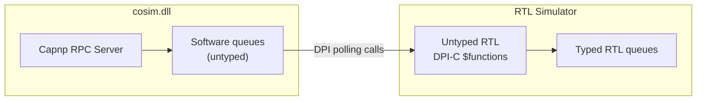
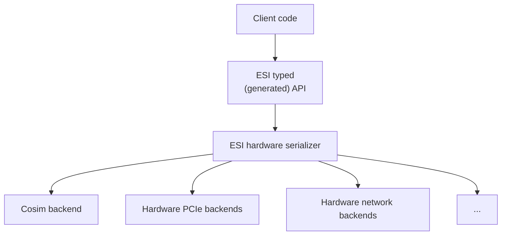
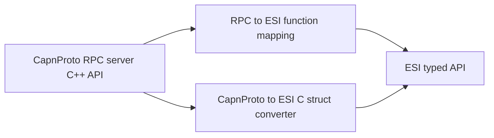

# ESI Co-simulation design doc

## Core cosim.dll

This CapnProto RPC server has a very simple interface: an enumeration
interface and a number of blob send/recv channels. It is untyped with regard
to the ESI schema.

## ESI C++ interface

The ESI-generated C++ API has several backend plugins, one of which is the
cosim backend which talks to a cosim server.

## CapnProto RPC interface

The CapnProto RPC interface is simply a shim to the ESI generated API. It can
thus act as a proxy to cosim or hardware.
