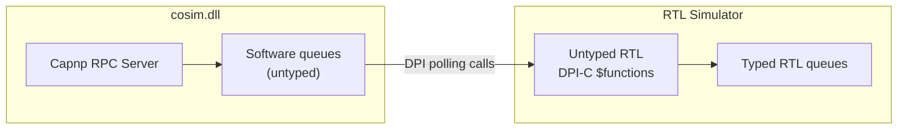
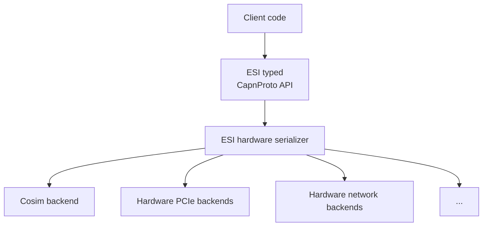
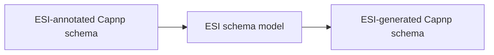

<!--
  Copyright (c) Microsoft Corporation.
  Licensed under the MIT License.
-->
# ESI Co-simulation design doc

## Core cosim.dll

This CapnProto RPC server has a very simple interface: an enumeration
interface and a number of blob send/recv channels. It is untyped with regard
to the ESI schema.

## ESI C++ interface

The ESI-generated C++ API has several backend plugins, one of which is the
cosim backend which talks to a cosim server.

## ESI-annotated CapnProto schema to normal Capnp schema

Basic idea: write a Capnp-schema to Capnp-schema translator which goes
through the ESI Type Schema. It would necessarily be lossy.
